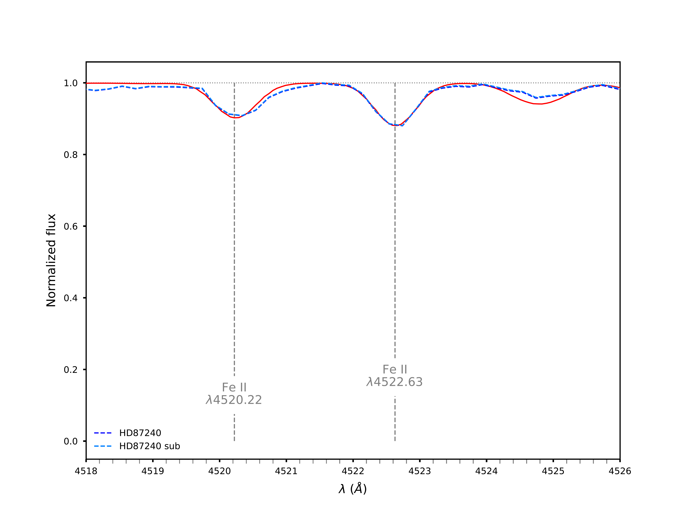

# spec_tools [](https://cloud.drone.io/a-lemonnier/spec_tools)


:eight_pointed_black_star: A set of codes for csv and for spectrum manipulation with a py wrapper or not:

:gear: List:
 - **threshold**.cpp: remove lines below a wavelength threshold (multi-threaded)
 - **trim**.cpp: cut a spectrum or more between two wavelengths (multi-threaded)
 - **findncopy**.cpp: find and copy files from a file list
 - **der_snr**.cpp: compute the Signal-to-Noise of a spectrum or from a folder containing spectra (multi-threaded)
 - **shift**.cpp: shift whole spectrum by a given wavelength (multi-threaded)
 - **gen_rand_spec**.cpp: generate a set of randomized-flux spectra between two wavelengths for test purposes (multi-threaded)
 - **marker**.cpp: highlight lines on spectrum and plot it in matplotlib plots
 
:wrench: TODO:
 - Fill Unit Tests
 - Fix _msg::_msg(const _msg&)
 - Fix copy constructors
 - **marker**.cpp: NOR in cmd check
 - Make classes in order to clean .cpp
 - Implement boost:: recursive directory copy
 - Add C++11 and C++14 compatibilities

---
This repo. works on Gentoo 17.0 x64 and Ubuntu x64: bionic and eoan.

:grey_exclamation: Dependencies:
- gcc > 7 
- CMake
- Boost >1.40
- Boost::program_options
- Boost::spirit
- Boost::tokenizer
- Boost::unit_test_framework

---
:floppy_disk: Get it:

```
gentoo - /home/gentoo % git clone https://github.com/a-lemonnier/spec_tools.git 
Clonage dans 'spec_tools'...
remote: Enumerating objects: 29, done.
remote: Counting objects: 100% (29/29), done.
remote: Compressing objects: 100% (17/17), done.
remote: Total 384 (delta 10), reused 22 (delta 8), pack-reused 355
Réception d'objets: 100% (384/384), 1.88 Mio | 3.68 Mio/s, fait.
Résolution des deltas: 100% (226/226), fait.

gentoo - /home/gentoo % cd spec_tools
```

---
> Compiling:
```
gentoo - spec_tools/ % cmake .
-- The C compiler identification is GNU 9.3.0
-- The CXX compiler identification is GNU 9.3.0
-- Check for working C compiler: /usr/bin/cc
-- Check for working C compiler: /usr/bin/cc - works
-- Detecting C compiler ABI info
-- Detecting C compiler ABI info - done
-- Detecting C compile features
-- Detecting C compile features - done
-- Check for working CXX compiler: /usr/bin/c++
-- Check for working CXX compiler: /usr/bin/c++ - works
-- Detecting CXX compiler ABI info
-- Detecting CXX compiler ABI info - done
-- Detecting CXX compile features
-- Detecting CXX compile features - done
-- Found Boost: /usr/include (found suitable version "1.72.0", minimum required is "1.40") found components: program_options timer filesystem chrono 
-- Configuring done
-- Generating done

gentoo - spec_tools/ % make -j$(nproc)
-- The C compiler identification is GNU 9.3.0
-- The CXX compiler identification is GNU 9.3.0
-- Check for working C compiler: /usr/bin/cc
-- Check for working C compiler: /usr/bin/cc -- works
-- Detecting C compiler ABI info
-- Detecting C compiler ABI info - done
-- Detecting C compile features
-- Detecting C compile features - done
-- Check for working CXX compiler: /usr/bin/c++
-- Check for working CXX compiler: /usr/bin/c++ -- works
-- Detecting CXX compiler ABI info
-- Detecting CXX compiler ABI info - done
-- Detecting CXX compile features
-- Detecting CXX compile features - done
-- Boost version: 1.72.0
-- Found the following Boost libraries:
--   program_options
--   timer
--   filesystem
--   chrono
--   system
-- Configuring done
-- Generating done
-- Build files have been written to: /drone/src
+ make -j$(nproc)
Scanning dependencies of target findncopy
Scanning dependencies of target der_snr
Scanning dependencies of target trim
Scanning dependencies of target threshold
Scanning dependencies of target shift
Scanning dependencies of target marker
Scanning dependencies of target genrandspec
[  9%] Building CXX object CMakeFiles/findncopy.dir/src/findncopy.cpp.o
[  9%] Building CXX object CMakeFiles/findncopy.dir/include/msg.cpp.o
[ 19%] Building CXX object CMakeFiles/der_snr.dir/src/der_snr.cpp.o
[ 19%] Building CXX object CMakeFiles/threshold.dir/src/threshold.cpp.o
[ 23%] Building CXX object CMakeFiles/trim.dir/src/trim.cpp.o
[ 28%] Building CXX object CMakeFiles/shift.dir/src/shift.cpp.o
[ 33%] Building CXX object CMakeFiles/genrandspec.dir/src/genrandspec.cpp.o
[ 38%] Building CXX object CMakeFiles/marker.dir/src/marker.cpp.o
[ 42%] Building CXX object CMakeFiles/marker.dir/include/msg.cpp.o
[ 47%] Building CXX object CMakeFiles/trim.dir/include/msg.cpp.o
[ 52%] Building CXX object CMakeFiles/genrandspec.dir/include/msg.cpp.o
[ 57%] Linking CXX executable findncopy
[ 57%] Built target findncopy
[ 61%] Building CXX object CMakeFiles/shift.dir/include/msg.cpp.o
[ 66%] Building CXX object CMakeFiles/threshold.dir/include/msg.cpp.o
[ 71%] Building CXX object CMakeFiles/der_snr.dir/include/msg.cpp.o
[ 76%] Linking CXX executable genrandspec
[ 76%] Built target genrandspec
[ 80%] Linking CXX executable threshold
[ 80%] Built target threshold
[ 85%] Linking CXX executable trim
[ 90%] Linking CXX executable shift
[ 90%] Built target shift
[ 90%] Built target trim
[ 95%] Linking CXX executable marker
[100%] Linking CXX executable der_snr
[100%] Built target marker
[100%] Built target der_snr

```

---
> findncopy
```
gentoo - spec_tools/ % ./findncopy -h
Usage:
  -h [ --help ]                     Display this help message
  -n [ --namelist ] arg             Filename of the list of name to find
  -i [ --i_folder ] arg             Name of the folder where original data are
  -o [ --o_folder ] arg (=data_out) Name of the folder where files will be 
                                    copied
  -e [ --exclude ] arg              Exclude files matching the string

Example:
% ls
data findncopy star_list.txt
# cat tar_list.txt
HD87205
HD87309
HD304836
CPD-591662
...
% ./findncopy -n star_list.txt -i data -o spectra -e sky
▶ findncopy
⚐ findncopy write history 
⚐ findncopy remove duplicates in history 
⚐ parsing file: 36 lines
⚐ searching file: 240 files found
⚐ erasing string: 'data'
⚐ creating directory list: done
⚐ creating folders: done
⚐ copying files: 174 files copied
⚐ findncopy:  0.176172s wall, 0.130000s user + 0.040000s system = 0.170000s CPU (96.5%)
```

---
> trim
```
gentoo - spec_tools/ % ./trim -h
Usage:
  -h [ --help ]                         Display this help message
  -l [ --min ] arg                      Minimum wavelength
  -u [ --max ] arg                      Maximum wavelength
  -i [ --input_folder ] arg             Name of the folder where original data 
                                        are
  -o [ --output_folder ] arg (=data_out)
                                        Set the directory where store new data.

Example:
% ./trim -l 4700 -u 4800 -i data -o spectra_trimmed
▶ trim
⚐ trim write history 
⚐ trim remove duplicates in history 
⚐ trim: starting 8 async threads
⚡ trim(2416052): 521 files parsed.
⚡ trim(2416051): 521 files parsed.
⚡ trim(2416054): 521 files parsed.
⚡ trim(2416053): 521 files parsed.
⚡ trim(2416055): 521 files parsed.
⚡ trim(2416050): 521 files parsed.
⚡ trim(2416056): 521 files parsed.
⚡ trim(2416057): 524 files parsed.
⚐ trim:  52.909230s wall, 296.410000s user + 0.710000s system = 297.120000s CPU (561.6%)
```

---
> threshold
```
gentoo - spec_tools/ % ./threshold -h

Usage:
  -h [ --help ]                         Display this help message
  -i [ --input_folder ] arg             Set the input directory.
  -o [ --output_folder ] arg (=data_out)
                                        Set the directory where set the 
                                        threshold.
  -t [ --threshold ] arg                Apply a threshold in all 2D spectrum 
                                        data.
                                        f<=threshold will be deleted.

Example:
% ./threshold -i data -o spectra -t 0
▶ threshold
⚐ threshold write history 
⚐ threshold remove duplicates in history 
⚐ threshold: starting 8 async threads
⚡ trim(2470785): 521 files parsed.
⚡ trim(2470786): 521 files parsed.
⚡ trim(2470787): 521 files parsed.
⚡ trim(2470784): 521 files parsed.
⚡ trim(2470783): 521 files parsed.
⚡ trim(2470788): 521 files parsed.
⚡ trim(2470789): 521 files parsed.
⚡ trim(2470790): 524 files parsed.
⚐ threshold:  57.269018s wall, 331.160000s user + 1.350000s system = 332.510000s CPU (580.6%)
```

---
> der_snr
```
gentoo - spec_tools/ % ./der_snr -h

Usage:
  -h [ --help ]                     Display this help message
  -f [ --filename ] arg             Filename of the spectrum
  -d [ --directory ] arg            Directory where compute the S/N
  -o [ --output ] arg (=output.csv) Filename of results
  -s [ --separator ] arg (=     )       The column separator. Do not set this 
                                    option for \tab.
  -e [ --exclude ] arg              Exclude a string in filenames
  
Examples:
% ./der_snr -f CPD-591792.obs
- CPD-591792.obs: S/N = 95.68

% ./der_snr -d data -o snr.csv
▶ der_snr 
⚐ der_snr write history 
⚐ der_snr remove duplicates in history 
⚐ der_snr check command line 
⚐ der_snr starting 8  async threads 
⚡ compute(321893): compute S/N for 521 files 
⚡ compute(321894): compute S/N for 521 files 
⚡ compute(321895): compute S/N for 521 files 
⚡ compute(321896): compute S/N for 521 files 
⚡ compute(321897): compute S/N for 521 files 
⚡ compute(321898): compute S/N for 521 files 
⚡ compute(321900): compute S/N for 524 files 
⚡ compute(321899): compute S/N for 521 files 
⚐ merge() merge file part1_snr.csv 
⚐ merge() merge file part2_snr.csv 
⚐ merge() merge file part3_snr.csv 
⚐ merge() merge file part4_snr.csv 
⚐ merge() merge file part5_snr.csv 
⚐ merge() merge file part6_snr.csv 
⚐ merge() merge file part7_snr.csv 
⚐ merge() merge file part8_snr.csv 
⚐ der_snr output: snr.csv 
⚐ der_snr  55.801060s wall, 321.340000s user + 0.210000s system = 321.550000s CPU (576.2%)


Ref:
F. Stoehr et al: DER_SNR: A Simple & General Spectroscopic Signal-to-Noise Measurement Algorithm
394, Astronomical Data Analysis Software and Systems (ADASS) XVII
2008ASPC..394..505S

```

---
> shift
```
gentoo - spec_tools/ % ./shift -h
Usage:
  -h [ --help ]                   Display this help message
  -w [ --wavelength ] arg         Wavelength
  -f [ --filename ] arg           Shift a single file
  -i [ --input_folder ] arg       Name of the folder where original data are
  -o [ --output ] arg (=data_out) Set the directory or the file where store new
                                  data.
  -s [ --separator ] arg (=     )     The column separator. Do not set this option 
                                  for \tab.

Example:
% ./shift -w -1.0 -f CD-592728.obs
▶ shift 
⚐ shift: check command line 
⚐ shift: shift the spectrum by -1 
⚐ shift: output: data_out 
⚐ shift:  0.043272s wall, 0.040000s user + 0.000000s system = 0.040000s CPU (92.4%)

```

---
> genrandspec
```
gentoo - spec_tools/ % ./genrandspec -h                                                                                                                       
Usage:
  -h [ --help ]                       Display this help message
  -l [ --minw ] arg (=4000)           Lower wavelength bound
  -u [ --maxw ] arg (=8000)           Upper wavelength bound
  -s [ --step ] arg (=0.0500000007)   Difference between two neighbored 
                                      wavelengths
  -o [ --output ] arg (=rand_spectra) Filename of folder results
  -s [ --separator ] arg (=     )         The column separator. Do not set this 
                                      option for \tab.

Example:
./shift -w -1.0 -f CD-592728.obs
▶ genrandspec 
⚐ genrandspec write history 
⚐ genrandspec remove duplicates in history 
⚐ genrandspec check command line 
⚐ genrandspec create 8 async threads 
⚐ genrandspec start 8 async threads 
⚡ run(470440): create spectra in rand_spectra/0  
⚡ run(470440): create spectra in rand_spectra/1  
⚡ run(470440): create spectra in rand_spectra/2  
⚡ run(470440): create spectra in rand_spectra/3  
⚡ run(470440): create spectra in rand_spectra/4  
⚡ run(470440): create spectra in rand_spectra/5  
⚡ run(470440): create spectra in rand_spectra/6  
⚡ run(470440): create spectra in rand_spectra/7  
⚐ genrandspec  10.694788s wall, 77.990000s user + 3.050000s system = 81.040000s CPU (757.8%) 

```

---
> marker
```
gentoo - spec_tools/ % ./marker -h
Usage:
  -h [ --help ]                 Display this help message
  -i [ --input ] arg            Set input files.
  -o [ --output ] arg           Set the output.
  -t [ --title ] arg            Set the title.
  -l [ --label ] arg            Set labels. If more than one label is defined, 
                                the number of labels must be equal to the 
                                numbers of files.
  --xmin arg                    Set the min range.
  --xmax arg                    Set the max range.
  --xlabel arg                  Set xlabel.
  --ylabel arg                  Set ylabel.
  --xunit arg                   Set xunit.
  --yunit arg                   Set yunit.
  --dpi arg (=300)              Set the dpi.
  --width arg (=0.25)           Set the width of curves.
  --contsize arg (=0.600000024) Set the continnum width.
  -s [ --sep ] arg              Set separators. If more than one sep is 
                                defined, the number of sep must be equal to the
                                numbers of files.
  -e [ --element ] arg          Set the name of an element. Ex: \$H\\\\beta\$.
  --elemlist arg                Set the line list: 
                                'Element 1', wavelength_1
                                'Element 2', wavelength_2
                                'Element 3', wavelength_3
                                ...
  -w [ --wavelength ] arg       Set the wavelength of the line.
  --shiftfirst arg              Shift the first spectrum
  --shift arg                   Shift spectra (except the first)
  -g [ --grid ]                 Show the grid.
  -v [ --verbose ]              Toggle verbosity.

Example:
% ./marker -i rand_spectra/0/0.dat -i rand_spectra/0/1.dat -l 0.dat -l 1.dat  -t Spectra -l 'Spectrum 1' -l 'Spectrum 2' -w 4861 -e \$H\\beta\$
▶ marker 
⚐ marker write history 
⚐ marker remove duplicates in history 
⚐ marker check command line and fill class 
⚐ marker set input: rand_spectra/0/0.dat with sep:'     ' 
⚐ marker set input: rand_spectra/0/1.dat with sep:'     ' 
⚐ marker data read and stored 
⚐ marker set data to plot 
⚐ marker set plot options 
⚐ marker write and run script 
⚐ marker  3.052816s wall, 2.760000s user + 0.070000s system = 2.830000s CPU (92.7%)

```

