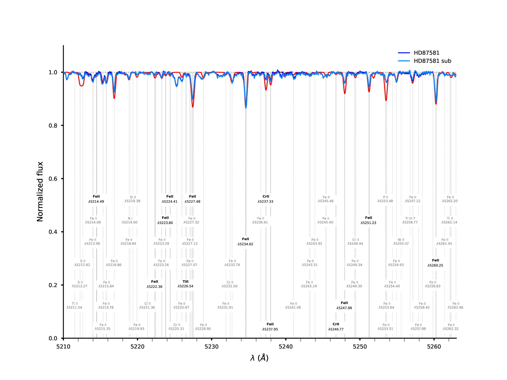

# spec_tools [](https://cloud.drone.io/a-lemonnier/spec_tools) 


A set of codes for csv and for spectrum manipulation.

List:

 - **threshold**.cpp: remove lines below a threshold
 - **trim**.cpp: cut a spectrum or more between two wavelengths 
 - **findncopy**.cpp: find and copy files from a file list
 - **der_snr**.cpp: compute the Signal-to-Noise of a spectrum
 - **shift**.cpp: shift whole spectrum by a given wavelength
 - **gen_rand_spec**.cpp: generate a set of randomized-flux spectra
 - **marker**.cpp: highlight lines on spectrum with matplotlib
 - **elemlist**.cpp: fill elemlist interactively
 
TODO:
 - ncurses elemlist
 - **msg**.h: Fix _msg::_msg(const _msg&)
 - boost::copy recursive directory
 
---

Dependencies:

- gcc >= 7 or clang >= 5 (smaller and slower (?) binary)
- CMake
- Boost >= 1.40
- Boost::program_options
- Boost::spirit
- Boost::tokenizer
- Boost::unit_test_framework
- python: matplotlib, numpy, csv

---

> marker




```
gentoo - spec_tools/ % ./marker -h
Usage:
  -h [ --help ]                 Display this help message
  -i [ --input ] arg            Set input files.
  -s [ --sep ] arg              Set separators. If more than one sep is 
                                defined, the number of sep must be equal to the
                                numbers of files.
  -o [ --output ] arg           Set the output.
  -t [ --title ] arg            Set the title.
  -l [ --label ] arg            Set labels. If more than one label is defined, 
                                the number of labels must be equal to the 
                                numbers of files.
  --xmin arg                    Set the min range.
  --xmax arg                    Set the max range.
  --ymin arg                    Set ymin.
  --ymax arg                    Set ymax...
  --xlabel arg                  Set xlabel.
  --ylabel arg                  Set ylabel.
  --xunit arg                   Set xunit.
  --yunit arg                   Set yunit.
  --width arg (=0.25)           Set the width of curves.
  --rgb arg                     Set the color of the first spectrum as 
                                RGBalpha: '#rrggbbaa'.
  --contsize arg (=0.600000024) Set the continuum width.
  --nolegend                    Disable the legend.
  --halfbox                     Show only left and bottom axis.
  --dotted                      Dotted curve.
  --dotdashed                   Dot-dashed curve.
  --fontsize arg                Set the font size.
  --wide                        Indicate if markers have to be adapted to the 
                                spectrum size.
  -e [ --element ] arg          Set the name of an element. Ex: \$H\\\\beta\$.
  -w [ --wavelength ] arg       Set the wavelength of the line.
  --elemlist arg                Set the line list: 
                                            'Elem 1',       wavelength_1
                                            'Elem 2',       wavelength_2
                                        !   'Elem 3 bold',  wavelength_3
                                        @!  'Elem 3 unbold',wavelength_3
                                        #   blabla          (comment)
                                        %   blablabla       (comment again)
                                ...
  --shiftfirst arg              Shift the first spectrum.
  --shift arg                   Shift spectra (except the first).
  -g [ --grid ]                 Show the grid.
  --dpi arg (=300)              Set the dpi.
  --nolog                       Toggle off log.
  -v [ --verbose ]              Toggle verbosity.

Example:
./marker -i rand_spectra/0/0.dat -i rand_spectra/0/1.dat -l 0.dat -l 1.dat  -t Spectra -l 'Spectrum 1' -l 'Spectrum 2' -w 4861 -e \$H\\beta\$ --nolog
▶ marker 
⚐ marker write history 
⚐ marker remove duplicates in history 
⚐ marker check command line and fill class 
⚐ marker set input: rand_spectra/0/0.dat with sep:'     ' 
⚐ marker set input: rand_spectra/0/1.dat with sep:'     ' 
⚐ marker data read and stored 
⚐ marker set data to plot 
⚐ marker set plot options 
⚐ marker write and run script 
⚐ marker  3.052816s wall, 2.760000s user + 0.070000s system = 2.830000s CPU (92.7%)

```

---

> findncopy

```

gentoo - spec_tools/ % ./findncopy -h
Usage:
  -h [ --help ]                     Display this help message
  -n [ --namelist ] arg             Filename of the list of name to find
  -i [ --i_folder ] arg             Name of the folder where original data are
  -o [ --o_folder ] arg (=data_out) Name of the folder where files will be 
                                    copied
  -e [ --exclude ] arg              Exclude files matching the string

Example:
% ls
data findncopy star_list.txt
# cat star_list.txt
HD87205
HD87309
HD304836
CPD-591662
...
% ./findncopy -n star_list.txt -i data -o spectra -e sky
▶ findncopy
⚐ findncopy write history 
⚐ findncopy remove duplicates in history 
⚐ parsing file: 36 lines
⚐ searching file: 240 files found
⚐ erasing string: 'data'
⚐ creating directory list: done
⚐ creating folders: done
⚐ copying files: 174 files copied
⚐ findncopy:  0.176172s wall, 0.130000s user + 0.040000s system = 0.170000s CPU (96.5%)

```

---

> trim

```

gentoo - spec_tools/ % ./trim -h
Usage:
  -h [ --help ]                         Display this help message
  -l [ --min ] arg                      Minimum wavelength
  -u [ --max ] arg                      Maximum wavelength
  -i [ --input_folder ] arg             Name of the folder where original data 
                                        are
  -o [ --output_folder ] arg (=data_out)
                                        Set the directory where store new data.

Example:
% ./trim -l 4700 -u 4800 -i data -o spectra_trimmed
▶ trim
⚐ trim write history 
⚐ trim remove duplicates in history 
⚐ trim CPU utilization: 3 % 
⚐ trim: starting 8 async threads
⚡ trim(2416052): 521 files parsed.
⚡ trim(2416051): 521 files parsed.
⚡ trim(2416054): 521 files parsed.
⚡ trim(2416053): 521 files parsed.
⚡ trim(2416055): 521 files parsed.
⚡ trim(2416050): 521 files parsed.
⚡ trim(2416056): 521 files parsed.
⚡ trim(2416057): 524 files parsed.
⚐ trim:  52.909230s wall, 296.410000s user + 0.710000s system = 297.120000s CPU (561.6%)

```

---

> threshold

```

gentoo - spec_tools/ % ./threshold -h

Usage:
  -h [ --help ]                         Display this help message
  -i [ --input_folder ] arg             Set the input directory.
  -o [ --output_folder ] arg (=data_out)
                                        Set the directory where set the 
                                        threshold.
  -t [ --threshold ] arg                Apply a threshold in all 2D spectrum 
                                        data.
                                        f<=threshold will be deleted.

Example:
% ./threshold -i data -o spectra -t 0
▶ threshold
⚐ threshold write history 
⚐ threshold remove duplicates in history 
⚐ genrandspec CPU utilization: 0 % 
⚐ threshold: starting 8 async threads
⚡ trim(2470785): 521 files parsed.
⚡ trim(2470786): 521 files parsed.
⚡ trim(2470787): 521 files parsed.
⚡ trim(2470784): 521 files parsed.
⚡ trim(2470783): 521 files parsed.
⚡ trim(2470788): 521 files parsed.
⚡ trim(2470789): 521 files parsed.
⚡ trim(2470790): 524 files parsed.
⚐ threshold:  57.269018s wall, 331.160000s user + 1.350000s system = 332.510000s CPU (580.6%)

```

---

> der_snr

```

gentoo - spec_tools/ % ./der_snr -h

Usage:
  -h [ --help ]                     Display this help message
  -f [ --filename ] arg             Filename of the spectrum
  -d [ --directory ] arg            Directory where compute the S/N
  -o [ --output ] arg (=output.csv) Filename of results
  -s [ --separator ] arg (=     )       The column separator. Do not set this 
                                    option for \tab.
  -e [ --exclude ] arg              Exclude a string in filenames
  
Examples:
% ./der_snr -f CPD-591792.obs
- CPD-591792.obs: S/N = 95.68

% ./der_snr -d data -o snr.csv
▶ der_snr 
⚐ der_snr write history 
⚐ der_snr remove duplicates in history 
⚐ der_snr check command line 
⚐ genrandspec CPU utilization: 1 % 
⚐ der_snr starting 8  async threads 
⚡ compute(321893): compute S/N for 521 files 
⚡ compute(321894): compute S/N for 521 files 
⚡ compute(321895): compute S/N for 521 files 
⚡ compute(321896): compute S/N for 521 files 
⚡ compute(321897): compute S/N for 521 files 
⚡ compute(321898): compute S/N for 521 files 
⚡ compute(321900): compute S/N for 524 files 
⚡ compute(321899): compute S/N for 521 files 
⚐ merge() merge file part1_snr.csv 
⚐ merge() merge file part2_snr.csv 
⚐ merge() merge file part3_snr.csv 
⚐ merge() merge file part4_snr.csv 
⚐ merge() merge file part5_snr.csv 
⚐ merge() merge file part6_snr.csv 
⚐ merge() merge file part7_snr.csv 
⚐ merge() merge file part8_snr.csv 
⚐ der_snr output: snr.csv 
⚐ der_snr  55.801060s wall, 321.340000s user + 0.210000s system = 321.550000s CPU (576.2%)


Ref:
F. Stoehr et al: DER_SNR: A Simple & General Spectroscopic Signal-to-Noise Measurement Algorithm
394, Astronomical Data Analysis Software and Systems (ADASS) XVII
2008ASPC..394..505S

```

---

> shift

```

gentoo - spec_tools/ % ./shift -h
Usage:
  -h [ --help ]                   Display this help message
  -w [ --wavelength ] arg         Wavelength
  -f [ --filename ] arg           Shift a single file
  -i [ --input_folder ] arg       Name of the folder where original data are
  -o [ --output ] arg (=data_out) Set the directory or the file where store new
                                  data.
  -s [ --separator ] arg (=     )     The column separator. Do not set this option 
                                  for \tab.

Example:
% ./shift -w -1.0 -f CD-592728.obs
▶ shift 
⚐ shift: check command line 
⚐ shift: shift the spectrum by -1 
⚐ shift: output: data_out 
⚐ shift:  0.043272s wall, 0.040000s user + 0.000000s system = 0.040000s CPU (92.4%)

```

---

> genrandspec


```

gentoo - spec_tools/ % ./genrandspec -h                                                                                                                       
Usage:
  -h [ --help ]                       Display this help message
  -l [ --minw ] arg (=4000)           Lower wavelength bound
  -u [ --maxw ] arg (=8000)           Upper wavelength bound
  -s [ --step ] arg (=0.0500000007)   Difference between two neighbored 
                                      wavelengths
  -o [ --output ] arg (=rand_spectra) Filename of folder results
  -s [ --separator ] arg (=     )         The column separator. Do not set this 
                                      option for \tab.

Example:
./genrandspec -l 4500 -u 4600
▶ genrandspec 
⚐ genrandspec write history 
⚐ genrandspec remove duplicates in history 
⚐ genrandspec check command line
⚐ genrandspec CPU utilization: 3 % 
⚐ genrandspec create 8 folders 
⚐ genrandspec start 8 async threads 
⚡ run(686277): create spectra in rand_spectra/0 
⚡ run(686278): create spectra in rand_spectra/1 
⚡ run(686279): create spectra in rand_spectra/2 
⚡ run(686280): create spectra in rand_spectra/3 
⚡ run(686281): create spectra in rand_spectra/4 
⚡ run(686282): create spectra in rand_spectra/5 
⚡ run(686283): create spectra in rand_spectra/6 
⚡ run(686284): create spectra in rand_spectra/7 
⚐ genrandspec  0.160590s wall, 1.070000s user + 0.000000s system = 1.070000s CPU (666.5%)

```

---

> elemlist

```
./elemlist -h
Usage:
  -h [ --help ]                  Display this help message
  -l [ --list ] arg (=line.list) Filename of elemlist
  -e [ --elem ] arg              The element.
  -w [ --wavelength ] arg        The wavelength.
  -M [ --Mask ]                  Comment the line: #
  -B [ --Bold ]                  Highlight the line: !
  -T [ --Temp ]                  Temporary comment: % or @!

./elemlist  -e "Fe II" -w 5001.59 -B
▶ elemlist 
⚐ elemlist write history 
⚐ elemlist remove duplicates in history 
⚐ elemlist add: Fe II 5001.59 
⚐ elemlist  0.001048s wall, 0.000000s user + 0.000000s system = 0.000000s CPU (n/a%)

```
TODO:


---

> Download:


```

gentoo - /home/gentoo % git clone https://github.com/a-lemonnier/spec_tools.git 
Clonage dans 'spec_tools'...
remote: Enumerating objects: 29, done.
remote: Counting objects: 100% (29/29), done.
remote: Compressing objects: 100% (17/17), done.
remote: Total 384 (delta 10), reused 22 (delta 8), pack-reused 355
Réception d'objets: 100% (384/384), 1.88 Mio | 3.68 Mio/s, fait.
Résolution des deltas: 100% (226/226), fait.

gentoo - /home/gentoo % cd spec_tools

```

---

> Compiling:

Toggle compiler in CMakeLists.txt:

- set(COMPILER gcc) -> gcc
- set(COMPILER clang) -> Clang
- set(COMPILER intel) -> Intel compiler

```

gentoo - spec_tools/ % cmake .
-- The C compiler identification is GNU 9.3.0
-- The CXX compiler identification is GNU 9.3.0
-- Check for working C compiler: /usr/bin/cc
-- Check for working C compiler: /usr/bin/cc - works
-- Detecting C compiler ABI info
-- Detecting C compiler ABI info - done
-- Detecting C compile features
-- Detecting C compile features - done
-- Check for working CXX compiler: /usr/bin/c++
-- Check for working CXX compiler: /usr/bin/c++ - works
-- Detecting CXX compiler ABI info
-- Detecting CXX compiler ABI info - done
-- Detecting CXX compile features
-- Detecting CXX compile features - done
-- Found Boost: /usr/include (found suitable version "1.72.0", minimum required is "1.40") found components: program_options timer filesystem chrono 
-- Configuring done
-- Generating done

gentoo - spec_tools/ % make -j$(nproc)
-- The C compiler identification is GNU 9.3.0
-- The CXX compiler identification is GNU 9.3.0
-- Check for working C compiler: /usr/bin/cc
-- Check for working C compiler: /usr/bin/cc -- works
-- Detecting C compiler ABI info
-- Detecting C compiler ABI info - done
-- Detecting C compile features
-- Detecting C compile features - done
-- Check for working CXX compiler: /usr/bin/c++
-- Check for working CXX compiler: /usr/bin/c++ -- works
-- Detecting CXX compiler ABI info
-- Detecting CXX compiler ABI info - done
-- Detecting CXX compile features
-- Detecting CXX compile features - done
-- Boost version: 1.72.0
-- Found the following Boost libraries:
--   program_options
--   timer
--   filesystem
--   chrono
--   system
-- Configuring done
-- Generating done
-- Build files have been written to: /drone/src
+ make -j$(nproc)
Scanning dependencies of target msg
Scanning dependencies of target der_snr
Scanning dependencies of target trim
Scanning dependencies of target threshold
Scanning dependencies of target shift
Scanning dependencies of target findncopy
Scanning dependencies of target marker
Scanning dependencies of target genrandspec
[  3%] Building CXX object CMakeFiles/msg.dir/include/msg.cpp.o
[  9%] Building CXX object CMakeFiles/findncopy.dir/src/findncopy.cpp.o
[  9%] Building CXX object CMakeFiles/trim.dir/src/trim.cpp.o
[ 12%] Building CXX object CMakeFiles/der_snr.dir/src/der_snr.cpp.o
[ 15%] Building CXX object CMakeFiles/genrandspec.dir/src/genrandspec.cpp.o
[ 18%] Building CXX object CMakeFiles/threshold.dir/src/threshold.cpp.o
[ 21%] Building CXX object CMakeFiles/marker.dir/src/marker.cpp.o
[ 25%] Building CXX object CMakeFiles/shift.dir/src/shift.cpp.o
[ 28%] Linking CXX static library libmsg.a
[ 28%] Built target msg
[ 31%] Building CXX object CMakeFiles/shift.dir/include/msg.cpp.o
[ 34%] Building CXX object CMakeFiles/marker.dir/include/msg.cpp.o
[ 37%] Building CXX object CMakeFiles/findncopy.dir/include/msg.cpp.o
[ 40%] Building CXX object CMakeFiles/der_snr.dir/include/msg.cpp.o
[ 43%] Linking CXX executable findncopy
[ 43%] Built target findncopy
[ 46%] Building CXX object CMakeFiles/trim.dir/include/msg.cpp.o
Scanning dependencies of target elemlist
[ 50%] Building CXX object CMakeFiles/elemlist.dir/src/elemlist.cpp.o
Scanning dependencies of target test_csv
[ 53%] Building CXX object CMakeFiles/test_csv.dir/test/test_csv.cpp.o
[ 59%] Linking CXX executable genrandspec
[ 59%] Built target genrandspec
[ 62%] Building CXX object CMakeFiles/elemlist.dir/include/msg.cpp.o
Scanning dependencies of target test_msg
[ 65%] Building CXX object CMakeFiles/test_msg.dir/test/test_msg.cpp.o
[ 68%] Building CXX object CMakeFiles/threshold.dir/include/msg.cpp.o
[ 71%] Linking CXX executable trim
[ 75%] Linking CXX executable elemlist
[ 75%] Built target elemlist
Scanning dependencies of target test_marker
[ 78%] Building CXX object CMakeFiles/test_marker.dir/test/test_marker.cpp.o
[ 78%] Built target trim
[ 81%] Linking CXX executable shift
[ 81%] Built target shift
[ 84%] Linking CXX executable threshold
[ 87%] Linking CXX executable der_snr
[ 90%] Linking CXX executable marker
[ 90%] Built target threshold
[ 90%] Built target der_snr
[ 90%] Built target marker
[ 93%] Linking CXX executable test_msg
[ 93%] Built target test_msg
[ 96%] Linking CXX executable test_csv
[ 96%] Built target test_csv
[100%] Linking CXX executable test_marker
[100%] Built target test_marker

```

> BUG:

 - **marker**.cpp with Intel compiler: std::tuple
 
```
/usr/lib/gcc/x86_64-pc-linux-gnu/9.3.0/include/g++-v9/tuple(553): error: pack "_UElements" does not have the same number of elements as "_Elements"
  	    __and_<is_nothrow_assignable<_Elements&, _UElements>...>::value;
  	                                             ^
          detected during:
            instantiation of "bool std::tuple<_Elements...>::__nothrow_assignable<_UElements...>() [with _Elements=<float, std::string, bool>, _UElements=<>]" at line 225 of "/usr/lib/gcc/x86_64-pc-linux-gnu/9.3.0/include/g++-v9/bits/stl_heap.h"
            instantiation of "void std::__adjust_heap(_RandomAccessIterator, _Distance, _Distance, _Tp, _Compare) [with _RandomAccessIterator=__gnu_cxx::__normal_iterator<std::tuple<float, std::string, bool> *, std::vector<std::tuple<float, std::string, bool>, std::allocator<std::tuple<float, std::string, bool>>>>, _Distance=std::ptrdiff_t={long}, _Tp=std::tuple<float, std::string, bool>, _Compare=__gnu_cxx::__ops::_Iter_less_iter]" at line 343 of
                      "/usr/lib/gcc/x86_64-pc-linux-gnu/9.3.0/include/g++-v9/bits/stl_heap.h"
            instantiation of "void std::__make_heap(_RandomAccessIterator, _RandomAccessIterator, _Compare &) [with _RandomAccessIterator=__gnu_cxx::__normal_iterator<std::tuple<float, std::string, bool> *, std::vector<std::tuple<float, std::string, bool>, std::allocator<std::tuple<float, std::string, bool>>>>, _Compare=__gnu_cxx::__ops::_Iter_less_iter]" at line 1671 of "/usr/lib/gcc/x86_64-pc-linux-gnu/9.3.0/include/g++-v9/bits/stl_algo.h"
            instantiation of "void std::__heap_select(_RandomAccessIterator, _RandomAccessIterator, _RandomAccessIterator, _Compare) [with _RandomAccessIterator=__gnu_cxx::__normal_iterator<std::tuple<float, std::string, bool> *, std::vector<std::tuple<float, std::string, bool>, std::allocator<std::tuple<float, std::string, bool>>>>, _Compare=__gnu_cxx::__ops::_Iter_less_iter]" at line 1932 of "/usr/lib/gcc/x86_64-pc-linux-gnu/9.3.0/include/g++-v9/bits/stl_algo.h"
            instantiation of "void std::__partial_sort(_RandomAccessIterator, _RandomAccessIterator, _RandomAccessIterator, _Compare) [with _RandomAccessIterator=__gnu_cxx::__normal_iterator<std::tuple<float, std::string, bool> *, std::vector<std::tuple<float, std::string, bool>, std::allocator<std::tuple<float, std::string, bool>>>>, _Compare=__gnu_cxx::__ops::_Iter_less_iter]" at line 1947 of "/usr/lib/gcc/x86_64-pc-linux-gnu/9.3.0/include/g++-v9/bits/stl_algo.h"
            instantiation of "void std::__introsort_loop(_RandomAccessIterator, _RandomAccessIterator, _Size, _Compare) [with _RandomAccessIterator=__gnu_cxx::__normal_iterator<std::tuple<float, std::string, bool> *, std::vector<std::tuple<float, std::string, bool>, std::allocator<std::tuple<float, std::string, bool>>>>, _Size=long, _Compare=__gnu_cxx::__ops::_Iter_less_iter]" at line 1969 of "/usr/lib/gcc/x86_64-pc-linux-gnu/9.3.0/include/g++-v9/bits/stl_algo.h"
            instantiation of "void std::__sort(_RandomAccessIterator, _RandomAccessIterator, _Compare) [with _RandomAccessIterator=__gnu_cxx::__normal_iterator<std::tuple<float, std::string, bool> *, std::vector<std::tuple<float, std::string, bool>, std::allocator<std::tuple<float, std::string, bool>>>>, _Compare=__gnu_cxx::__ops::_Iter_less_iter]" at line 4867 of "/usr/lib/gcc/x86_64-pc-linux-gnu/9.3.0/include/g++-v9/bits/stl_algo.h"
            instantiation of "void std::sort(_RAIter, _RAIter) [with _RAIter=__gnu_cxx::__normal_iterator<std::tuple<float, std::string, bool> *, std::vector<std::tuple<float, std::string, bool>, std::allocator<std::tuple<float, std::string, bool>>>>]" at line 227 of "/home/gentoo/Prog/cpp/spec_tools/src/marker.cpp"
```
